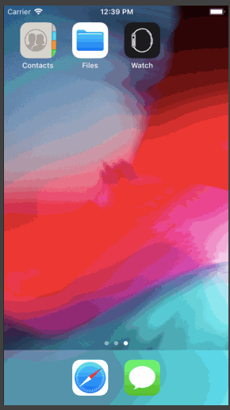

## Tiptron
Tiptron is a tip calculator application for iOS – and my first ever project in Swift!
Submitted by: Rajeev Ram

## User Stories

* [X] User can enter a bill amount, choose a tip percentage, and see the tip and total values.
* [X] User can choose from three differently colored themes that change the background and text.
* [X] User can access settings page to change the default tip percentage or enter custom tip percentage.
* [X] The default and custom percentages and theme selection are persistent.
* [X] Abstract data sharing between views to a delegation architecture with static variables.
* [X] The keyboard is always the first responder, but can be tapped away as desired.
* [X] Stylized icon and launch screen when application is opened.
* [X] Autolayout for iPhone 8 Plus, iPhone SE, and iPhone XR

## Video Walkthrough 
Here's a GIF walkthrough of implemented user stories: 

Here is a more comprehensive video presentation: https://youtu.be/OIb5PWBb7M8 

Download the [accompanying presentation slides](https://drive.google.com/file/d/1zJz6Bw3VLUWNzCPGt_Wbdr30ccWGT3Ld/view?usp=sharing) to scroll through while you watch.

## Notes

This project has been significantly updated at of October 2018. There will be a new walkthrough GIF, video, and presentation slides coming soon.

## License

    Copyright 2018 © Rajeev Ram
